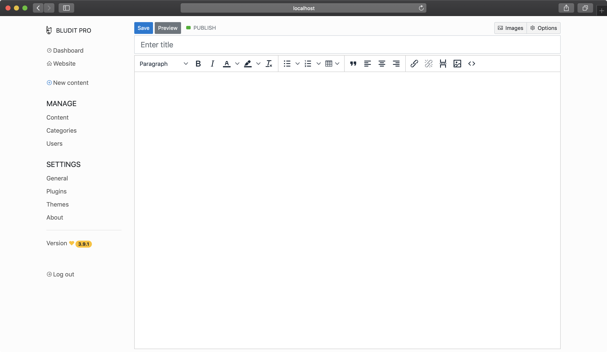

<!--
N.B.: This README was automatically generated by <https://github.com/YunoHost/apps/tree/master/tools/readme_generator>
It shall NOT be edited by hand.
-->

# Bludit for YunoHost

[](https://ci-apps.yunohost.org/ci/apps/bludit/)  

[](https://install-app.yunohost.org/?app=bludit)

*[Read this README in other languages.](./ALL_README.md)*

> *This package allows you to install Bludit quickly and simply on a YunoHost server.*  
> *If you don't have YunoHost, please consult [the guide](https://yunohost.org/install) to learn how to install it.*

## Overview

Bludit is a web application to build your own website or blog in seconds, it's completely free and open source. Bludit uses files in JSON format to store the content, you don't need to install or configure a database. You only need a web server with PHP support. Bludit is a Flat-File CMS. Bludit supports Markdown and HTML code for the content.

**Shipped version:** 3.16.2~ynh1

**Demo:** <https://demo.bludit.com>

## Screenshots



## Documentation and resources

- Official app website: <www.bludit.com>
- Official admin documentation: <https://docs.bludit.com/en/>
- Upstream app code repository: <https://github.com/bludit/bludit>
- YunoHost Store: <https://apps.yunohost.org/app/bludit>
- Report a bug: <https://github.com/YunoHost-Apps/bludit_ynh/issues>

## Developer info

Please send your pull request to the [`testing` branch](https://github.com/YunoHost-Apps/bludit_ynh/tree/testing).

To try the `testing` branch, please proceed like that:

```bash
sudo yunohost app install https://github.com/YunoHost-Apps/bludit_ynh/tree/testing --debug
or
sudo yunohost app upgrade bludit -u https://github.com/YunoHost-Apps/bludit_ynh/tree/testing --debug
```

**More info regarding app packaging:** <https://yunohost.org/packaging_apps>
