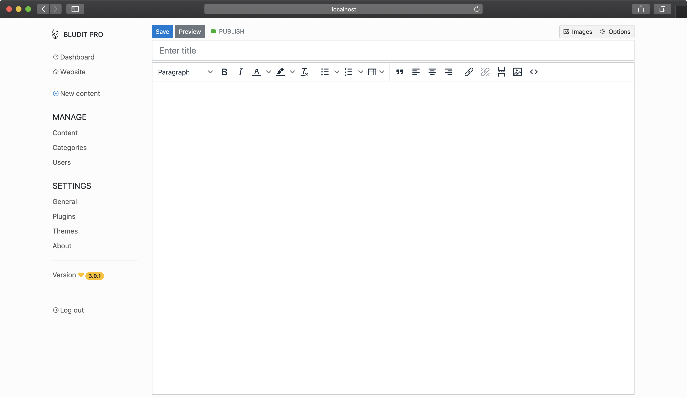

<!--
NOTA: Este README foi creado automáticamente por <https://github.com/YunoHost/apps/tree/master/tools/readme_generator>
NON debe editarse manualmente.
-->

# Bludit para YunoHost

[](https://ci-apps.yunohost.org/ci/apps/bludit/)  

[](https://install-app.yunohost.org/?app=bludit)

*[Le este README en outros idiomas.](./ALL_README.md)*

> *Este paquete permíteche instalar Bludit de xeito rápido e doado nun servidor YunoHost.*  
> *Se non usas YunoHost, le a [documentación](https://yunohost.org/install) para saber como instalalo.*

## Vista xeral

Bludit is a web application to build your own website or blog in seconds, it's completely free and open source. Bludit uses files in JSON format to store the content, you don't need to install or configure a database. You only need a web server with PHP support. Bludit is a Flat-File CMS. Bludit supports Markdown and HTML code for the content.

**Versión proporcionada:** 3.16.2~ynh2

**Demo:** <https://demo.bludit.com>

## Capturas de pantalla



## Documentación e recursos

- Web oficial da app: <www.bludit.com>
- Documentación oficial para admin: <https://docs.bludit.com/en/>
- Repositorio de orixe do código: <https://github.com/bludit/bludit>
- Tenda YunoHost: <https://apps.yunohost.org/app/bludit>
- Informar dun problema: <https://github.com/YunoHost-Apps/bludit_ynh/issues>

## Info de desenvolvemento

Envía a túa colaboración á [rama `testing`](https://github.com/YunoHost-Apps/bludit_ynh/tree/testing).

Para probar a rama `testing`, procede deste xeito:

```bash
sudo yunohost app install https://github.com/YunoHost-Apps/bludit_ynh/tree/testing --debug
ou
sudo yunohost app upgrade bludit -u https://github.com/YunoHost-Apps/bludit_ynh/tree/testing --debug
```

**Máis info sobre o empaquetado da app:** <https://yunohost.org/packaging_apps>
